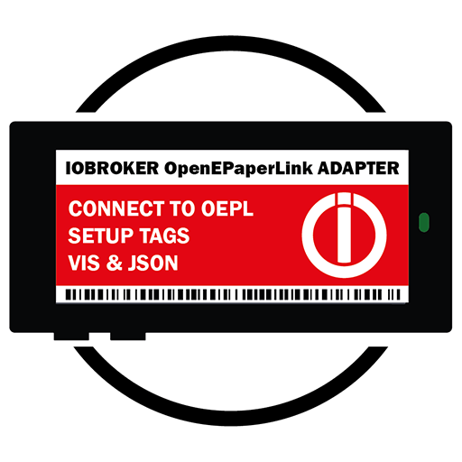

# ioBroker.open-epaper-link

**Tests:** 

## open-epaper-link adapter for ioBroker

Alternative firmware and protocol for the ZBS243-based Electronic Shelf Labels - ESL / price tags by Solum / Samsung. It can be used to setup E-Paper tags and supply them with content.
See GitHub Project 

This adapter specifically focuses on facilitating communication between the OEPL Access Point and iobroker. It serves as a tool to streamline and enhance the interaction between these two components, enabling seamless integration and communication between the OEPL system and iobroker. The mentioned resources provide valuable information to understand and optimize this communication for effective system operation.

The OpenEPaperLink adapter is designed to seamlessly integrate all displays and access points from OpenEPaperLink into the iobroker object structure. This integration is structured within the main folder "openepaperlink," categorized and organized based on the MAC addresses of individual tags and devices.

Within the iobroker system, a central "openepaperlink" folder is created to group all connected devices. This main folder serves as a container, ensuring a clear and organized representation of various displays and access points. Devices are organized according to their unique MAC addresses. This method allows for clear identification and separation of each device within the iobroker system. Each display and access point has its own specific structure within the main folder, facilitating targeted management and control of individual devices.

This structured integration into the iobroker object structure ensures a user-friendly and organized representation of all OpenEPaperLink devices within the iobroker system. It enables efficient management, control, and interaction with OpenEPaperLink displays and access points through the iobroker interface.

## For more information about OpenEPaperLink, valuable insights can be found at:

https://www.openepaperlink.de

https://github.com/jjwbruijn/OpenEPaperLink

## Additionally, comprehensive tutorials and demonstrations about OpenEPaperLink are available in various YouTube videos by ATC1441, including:

https://www.youtube.com/watch?v=Etonkolz9Bs

https://www.youtube.com/watch?v=98fOzZs__fc

These resources offer a wealth of information and guidance on understanding and utilizing OpenEPaperLink effectively.

> [!Note] Development status
> This repository currently only has a basic "meta" adapter source and admin configuration framework which will be translated to a working solution during the next weeks.

## Changelog
<!--
	Placeholder for the next version (at the beginning of the line):
	### **WORK IN PROGRESS**
-->

### **WORK IN PROGRESS**
* (ticaki / DutchmanNL) initial release

## License
MIT License

Copyright (c) 2023 DutchmanNL <oss@DrozmotiX.eu>

Permission is hereby granted, free of charge, to any person obtaining a copy
of this software and associated documentation files (the "Software"), to deal
in the Software without restriction, including without limitation the rights
to use, copy, modify, merge, publish, distribute, sublicense, and/or sell
copies of the Software, and to permit persons to whom the Software is
furnished to do so, subject to the following conditions:

The above copyright notice and this permission notice shall be included in all
copies or substantial portions of the Software.

THE SOFTWARE IS PROVIDED "AS IS", WITHOUT WARRANTY OF ANY KIND, EXPRESS OR
IMPLIED, INCLUDING BUT NOT LIMITED TO THE WARRANTIES OF MERCHANTABILITY,
FITNESS FOR A PARTICULAR PURPOSE AND NONINFRINGEMENT. IN NO EVENT SHALL THE
AUTHORS OR COPYRIGHT HOLDERS BE LIABLE FOR ANY CLAIM, DAMAGES OR OTHER
LIABILITY, WHETHER IN AN ACTION OF CONTRACT, TORT OR OTHERWISE, ARISING FROM,
OUT OF OR IN CONNECTION WITH THE SOFTWARE OR THE USE OR OTHER DEALINGS IN THE
SOFTWARE.
